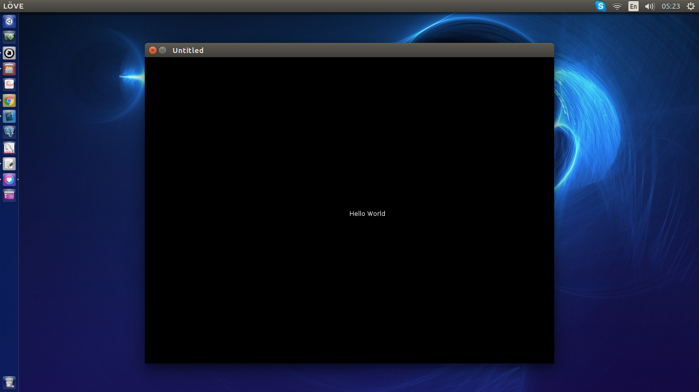

Install Menggunakan ubuntu PPA. buka terminal favorit anda:

```ruby
sudo add-apt-repository ppa:bartbes/love-stable
sudo apt-get update
sudo apt install love
```

jika sudah berhasil, cek versi love2d:
```
➜ love --version
LOVE 11.1 (Mysterious Mysteries)
```

Yay.. Love2d sudah berhasil di install. Tetapi Belum afdol kalo belum membuat game `hello world` :D. Buat file `main.lua`, misal didalam folder project kita `love_test`:

```
mkdir love_test
touch main.lua
```

edit main.lua dengan editor favorit anda:

```lua
function love.draw()
    love.graphics.print("Hello World", 400, 300)
end
```
cara menjalankan gamenya. masuk ke direktori love_test. jalankan perintah:

```
zip -9 -r Test.love . 
love Test.love

```


